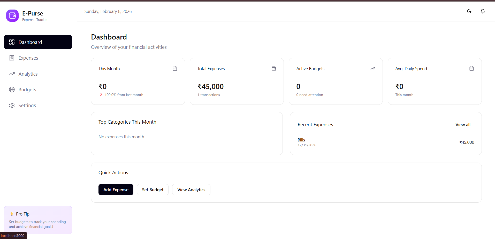
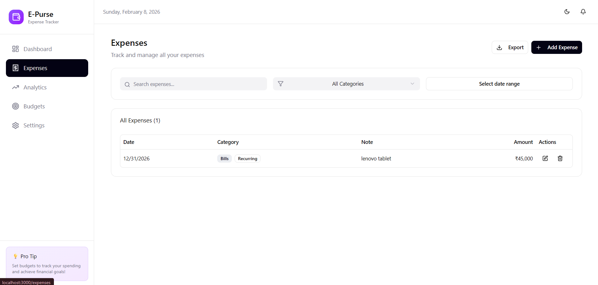
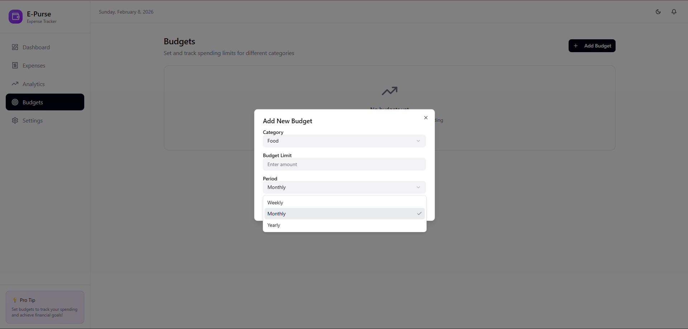
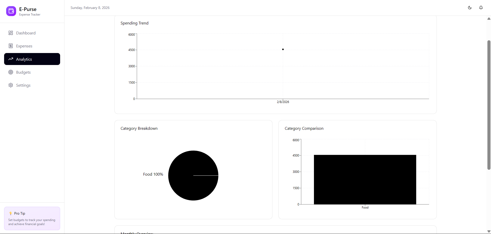

#  E-Purse — Expense & Budget Tracker

E-Purse is a **user-friendly expense and budget tracking web application** built to strengthen my practical understanding of **React** while working on a real-world dashboard-based project.

The app helps users **track expenses**, **manage budgets**, and **analyze spending patterns** through a clean and intuitive interface.

---

## 🚀 Purpose of This Project

This project is primarily built to:

- Enhance my **React fundamentals**
- Practice **component-based architecture**
- Work with **state management, hooks, and data flow**
- Build a **realistic dashboard UI**
- Learn how a finance-related application is structured

---

## ✨ Key Features

###  Dashboard

- Clean, modern, and responsive dashboard
- Monthly overview of expenses
- Average daily spend
- Active budgets status
- Recent expenses list
  

###  Expense Tracking

- Add and view expenses
- Categorize expenses
- View total and monthly expenses
  

###  Budget Management

- Create and manage budgets
- Track budget usage
- Identify budgets that need attention
  ](image-3.png)

###  Analytics

- Expense analytics by category
- Monthly spending insights
- Visual understanding of expense data
  

###  Data Upload Support

- Upload **data files / data sheets**
- Handle small structured data objects
- Useful for importing expense records

---

##  Tech Stack

- **React** (Frontend Library)
- **Vite** (Fast development & build tool)
- **JavaScript / TypeScript**
- **CSS** (Custom styling)
- **Modern React Hooks**

---

##  UI Highlights

- User-friendly layout
- Sidebar navigation
- Card-based financial summaries
- Minimal and professional design
- Focus on clarity and usability

---

##  Learning Outcomes

Through this project, I practiced:

- React component structuring
- Props & state handling
- Hooks usage
- Dashboard layout design
- Real-world feature planning
- Clean UI/UX principles

---

## Demo link https://e-purse.netlify.app/

## ⚙️ Installation & Setup

```bash
# Clone the repository
https://github.com/Harshxo44/E-Purse

# Navigate to project folder
cd E-PURSE

# Install dependencies
npm install

# Run development server
npm run dev
```
"# E-Purse" 
